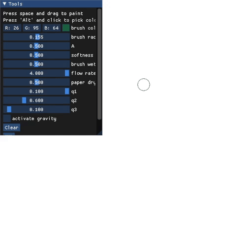
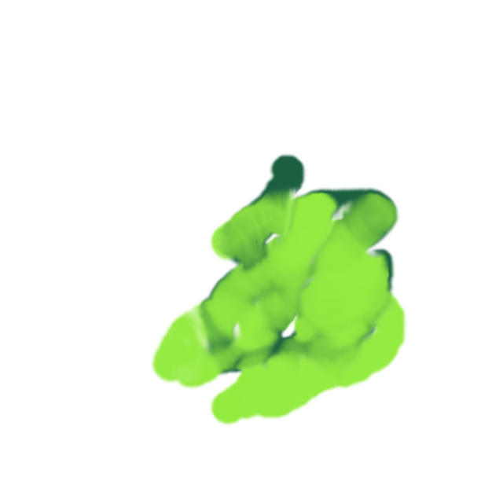
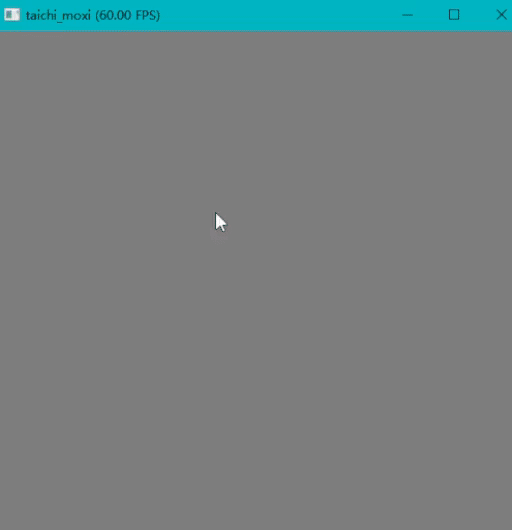

# Taichi-Moxi
An instantiation of a real-time ink dispersion engine called Moxi implimented with Taichi language. Supporting sparse calculation.

## Usage
Just run the demo.py file.

## Demo




## Files discription
```
-Taichi_Moxi.py     The main engine file
-demo.py            A GUI using Taichi_Moxi.py
```

## Refernces
[Moxi thesis](http://visgraph.cse.ust.hk/MoXi/moxi.pdf)

[Taichi Graphics](https://taichi.graphics/)
